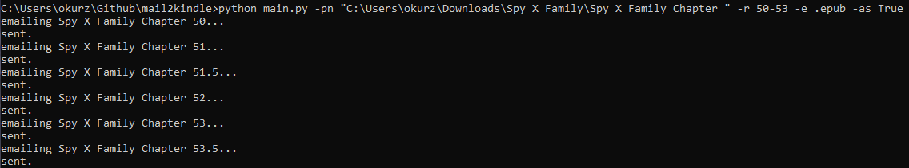

# mail2kindle
Easy way for me to send books or comic/manga chapters.

SMTP ports 465 and 587 are tested working, port 25 is not tested

1. make a copy of config_example.py rename it to config.py and fill it in.
2. run main.py -h to see what arguments you can use to send your books or comic/manga chapters

# Real world use
The command I used to send manga chapters:

My Kindle 11 showing that the chapters were downloaded:

# 2 modes of operation

## Sending numbered chapters Chapters
- Your files need to have the same name and only differ in a number.
for example `D:\Books\Spy X Family Chapter 40.epub`
- you need to enter `-pn "D:\Books\py X Family Chapter "` including the space
than range of chapters you want -r `40-50`,
- and the extencion or text after the chapter number in my case it's just `".epub"`
- lastly if there are sub chapters like .1, .5, ,9 just add `-as True`

pictures from testing without actually mailing, therefor missing the sent part.

## Sending Books
This option let's you send any files you want just provide path to the files in quotes separated by space.

pictures from testing without actually mailing, therefor missing the sent part.

