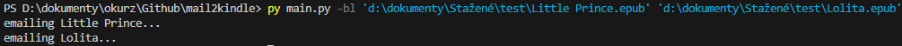

# mail2kindle
Easy way for me to send books or comic/managa chapters.

1. fill it config_example.py and rename it to comfig.py
2. use -h to see what arguments you can use

## Sending Chapters

## Sending Books

