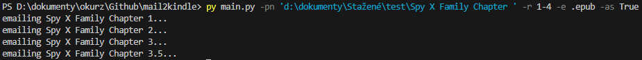

# mail2kindle
Easy way for me to send books or comic/managa chapters.

1. fill in config_example.py and rename it to config.py
2. run main.py -h to see what arguments you can use

## Sending Chapters

## Sending Books

